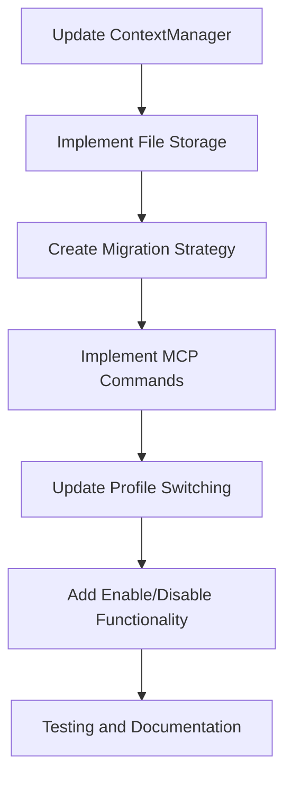

# Profile-Based MCP Configurations Detailed Implementation Plan

After reviewing the planning documents and examining the codebase, this document outlines a comprehensive plan to implement profile-based MCP configurations for the Amazon Q Developer CLI. This feature will allow users to maintain different sets of MCP servers for different profiles, making it easier to switch between different development environments.

## Current System Understanding

### Profile System
- Profiles are managed through `ContextManager` in `crates/chat-cli/src/cli/chat/context.rs`
- Each profile has its own context files stored in JSON format
- Users can create, delete, rename, and switch between profiles using `/profile` commands
- The "default" profile is always available, and "global" context files are available across all profiles

### MCP Server Configuration
- MCP servers are configured in `McpServerConfig` in `crates/chat-cli/src/cli/chat/tool_manager.rs`
- Currently stored in a single `mcp.json` file in either workspace or global location
- No profile-based management exists yet

## Implementation Plan

### 1. Extend Profile Data Structure

We need to modify the `ContextManager` to include MCP server configurations:

```rust
// In crates/chat-cli/src/cli/chat/context.rs
pub struct ContextManager {
    // Existing fields...
    
    /// MCP server configurations for the current profile
    pub profile_mcp_config: McpServerConfig,
    
    /// Global MCP server configurations (available across all profiles)
    pub global_mcp_config: McpServerConfig,
}
```

### 2. Update File Storage

We'll store MCP configurations in each profile directory:

```
~/.config/amazon-q/profiles/
├── default/
│   ├── context.json
│   └── mcp.json       // New file for profile-specific MCP servers
├── dev/
│   ├── context.json
│   └── mcp.json
└── ...
```

### 3. Migration Strategy

When the feature is first used:
1. Read existing MCP configurations from the current global/workspace locations
2. Move these configurations to the default profile's MCP configuration
3. Perform this migration only once and save a flag to indicate it's been done

### 4. Command Implementation

We'll implement the following commands:

```
/mcp add <url> [--global]     # Add MCP server to current profile (or global)
/mcp remove <url> [--global]  # Remove MCP server from current profile (or global)
/mcp list [--global]          # List MCP servers in current profile (or global)
/mcp enable <url>             # Enable MCP server in current profile
/mcp disable <url>            # Disable MCP server in current profile
/mcp show                     # Show currently enabled MCP servers
```

### 5. Profile Switching Integration

When a user switches profiles using `/profile set <name>`:
1. Save the current MCP configuration to the previous profile
2. Load the MCP configuration from the new profile
3. Disconnect from inactive MCP servers
4. Connect to newly active MCP servers
5. Notify the user of the change

### 6. Implementation Phases

#### Phase 1: Core Infrastructure
- Update `ContextManager` to include MCP server configurations
- Implement file storage for profile-specific MCP configurations
- Create migration strategy for existing MCP servers

#### Phase 2: Command Implementation
- Implement `/mcp` commands for managing profile-specific MCP servers
- Update profile switching to handle MCP configurations
- Add enable/disable functionality

#### Phase 3: Testing and Refinement
- Write unit tests for all new functionality
- Write integration tests for the feature
- Update documentation

## Technical Approach

Here's a more detailed technical approach for implementing this feature:



### Key Files to Modify

1. `crates/chat-cli/src/cli/chat/context.rs` - Extend `ContextManager` to include MCP configurations
2. `crates/chat-cli/src/cli/chat/tool_manager.rs` - Update MCP server loading to work with profiles
3. `crates/chat-cli/src/cli/chat/mcp.rs` - Implement new MCP commands
4. `crates/chat-cli/src/cli/chat/command.rs` - Add command parsing for new MCP commands
5. `crates/chat-cli/src/cli/chat/command_handler.rs` - Implement command handlers

### Potential Challenges

1. **Backward Compatibility**: Ensuring existing MCP configurations are properly migrated
2. **Performance**: Managing connections to MCP servers when switching profiles
3. **Error Handling**: Gracefully handling connection failures when switching profiles
4. **User Experience**: Providing clear feedback when MCP configurations change

## Implementation Details

### Phase 1: Core Infrastructure

#### Task 1.1: Update ContextManager

```rust
// Add to crates/chat-cli/src/cli/chat/context.rs

/// Path to the MCP config file for a profile
pub fn profile_mcp_path(ctx: &Context, profile_name: &str) -> Result<PathBuf> {
    Ok(directories::chat_profiles_dir(ctx)?
        .join(profile_name)
        .join("mcp.json"))
}

// Update ContextManager struct
pub struct ContextManager {
    // Existing fields...
    
    /// MCP server configurations for the current profile
    pub profile_mcp_config: McpServerConfig,
    
    /// Global MCP server configurations (available across all profiles)
    pub global_mcp_config: McpServerConfig,
}

// Update ContextManager::new
pub async fn new(ctx: Arc<Context>, max_context_files_size: Option<usize>) -> Result<Self> {
    // Existing code...
    
    let global_mcp_config = load_global_mcp_config(&ctx).await?;
    let profile_mcp_config = load_profile_mcp_config(&ctx, &current_profile).await?;
    
    Ok(Self {
        // Existing fields...
        global_mcp_config,
        profile_mcp_config,
    })
}

// Add new functions
async fn load_global_mcp_config(ctx: &Context) -> Result<McpServerConfig> {
    let global_path = global_mcp_config_path(ctx)?;
    if ctx.fs().exists(&global_path) {
        let contents = ctx.fs().read_to_string(&global_path).await?;
        let config: McpServerConfig = serde_json::from_str(&contents)
            .map_err(|e| eyre!("Failed to parse global MCP configuration: {}", e))?;
        Ok(config)
    } else {
        Ok(McpServerConfig::default())
    }
}

async fn load_profile_mcp_config(ctx: &Context, profile_name: &str) -> Result<McpServerConfig> {
    let profile_path = profile_mcp_path(ctx, profile_name)?;
    if ctx.fs().exists(&profile_path) {
        let contents = ctx.fs().read_to_string(&profile_path).await?;
        let config: McpServerConfig = serde_json::from_str(&contents)
            .map_err(|e| eyre!("Failed to parse profile MCP configuration: {}", e))?;
        Ok(config)
    } else {
        Ok(McpServerConfig::default())
    }
}

// Update save_config to also save MCP configurations
async fn save_config(&self, global: bool) -> Result<()> {
    // Existing code for saving context configs...
    
    // Save MCP configs
    if global {
        let global_mcp_path = global_mcp_config_path(&self.ctx)?;
        let contents = serde_json::to_string_pretty(&self.global_mcp_config)
            .map_err(|e| eyre!("Failed to serialize global MCP configuration: {}", e))?;
        self.ctx.fs().write(&global_mcp_path, contents).await?;
    } else {
        let profile_mcp_path = profile_mcp_path(&self.ctx, &self.current_profile)?;
        if let Some(parent) = profile_mcp_path.parent() {
            self.ctx.fs().create_dir_all(parent).await?;
        }
        let contents = serde_json::to_string_pretty(&self.profile_mcp_config)
            .map_err(|e| eyre!("Failed to serialize profile MCP configuration: {}", e))?;
        self.ctx.fs().write(&profile_mcp_path, contents).await?;
    }
    
    Ok(())
}

// Update switch_profile to also switch MCP configurations
pub async fn switch_profile(&mut self, name: &str) -> Result<()> {
    // Existing validation code...
    
    // Save current profile MCP config
    self.save_config(false).await?;
    
    // Load new profile MCP config
    self.profile_mcp_config = load_profile_mcp_config(&self.ctx, name).await?;
    
    // Existing code to update current_profile and profile_config...
    
    Ok(())
}
```

#### Task 1.2: Implement Migration Strategy

```rust
// Add to crates/chat-cli/src/cli/chat/context.rs

/// Migrate existing MCP configurations to the profile system
pub async fn migrate_mcp_configs(&mut self) -> Result<()> {
    // Check if migration has already been done
    let settings = Database::new()?;
    if settings.get_bool(Setting::McpLoadedBefore).unwrap_or(false) {
        return Ok(());
    }
    
    // Load existing MCP configurations
    let workspace_path = workspace_mcp_config_path(&self.ctx)?;
    let global_path = global_mcp_config_path(&self.ctx)?;
    
    // Migrate workspace config to profile config
    if self.ctx.fs().exists(&workspace_path) {
        let contents = self.ctx.fs().read_to_string(&workspace_path).await?;
        let workspace_config: McpServerConfig = serde_json::from_str(&contents)
            .map_err(|e| eyre!("Failed to parse workspace MCP configuration: {}", e))?;
        
        // Merge with profile config
        for (name, server) in workspace_config.mcp_servers {
            self.profile_mcp_config.mcp_servers.insert(name, server);
        }
    }
    
    // Migrate global config to global profile config
    if self.ctx.fs().exists(&global_path) {
        let contents = self.ctx.fs().read_to_string(&global_path).await?;
        let global_config: McpServerConfig = serde_json::from_str(&contents)
            .map_err(|e| eyre!("Failed to parse global MCP configuration: {}", e))?;
        
        // Merge with global config
        for (name, server) in global_config.mcp_servers {
            self.global_mcp_config.mcp_servers.insert(name, server);
        }
    }
    
    // Save the migrated configurations
    self.save_config(true).await?;
    self.save_config(false).await?;
    
    // Mark migration as done
    settings.set_bool(Setting::McpLoadedBefore, true)?;
    
    Ok(())
}
```

### Phase 2: Command Implementation

#### Task 2.1: Update MCP Commands

```rust
// Update crates/chat-cli/src/cli/chat/mcp.rs

// Update add_mcp_server
pub async fn add_mcp_server(ctx: &Context, output: &mut SharedWriter, args: McpAdd) -> Result<()> {
    let mut context_manager = ContextManager::new(Arc::new(ctx.clone()), None).await?;
    
    // Migrate existing configs if needed
    context_manager.migrate_mcp_configs().await?;
    
    let global = args.scope == Some(Scope::Global);
    let config = if global {
        &mut context_manager.global_mcp_config
    } else {
        &mut context_manager.profile_mcp_config
    };
    
    // Rest of the function remains similar...
    
    // Save the updated configuration
    context_manager.save_config(global).await?;
    
    Ok(())
}

// Similarly update other MCP commands (remove, list, etc.)
```

#### Task 2.2: Implement Enable/Disable Functionality

```rust
// Add to crates/chat-cli/src/cli/chat/mcp.rs

pub async fn enable_mcp_server(ctx: &Context, output: &mut SharedWriter, name: String) -> Result<()> {
    let mut context_manager = ContextManager::new(Arc::new(ctx.clone()), None).await?;
    
    // Check if server exists in profile config
    if let Some(server) = context_manager.profile_mcp_config.mcp_servers.get_mut(&name) {
        server.enabled = true;
        context_manager.save_config(false).await?;
        writeln!(output, "Enabled MCP server: {}", name)?;
        return Ok(());
    }
    
    // Check if server exists in global config
    if let Some(_) = context_manager.global_mcp_config.mcp_servers.get(&name) {
        return Err(eyre!("Cannot enable global MCP server '{}' in profile. Use --global flag.", name));
    }
    
    Err(eyre!("MCP server '{}' not found", name))
}

pub async fn disable_mcp_server(ctx: &Context, output: &mut SharedWriter, name: String) -> Result<()> {
    let mut context_manager = ContextManager::new(Arc::new(ctx.clone()), None).await?;
    
    // Check if server exists in profile config
    if let Some(server) = context_manager.profile_mcp_config.mcp_servers.get_mut(&name) {
        server.enabled = false;
        context_manager.save_config(false).await?;
        writeln!(output, "Disabled MCP server: {}", name)?;
        return Ok(());
    }
    
    // Check if server exists in global config
    if let Some(_) = context_manager.global_mcp_config.mcp_servers.get(&name) {
        return Err(eyre!("Cannot disable global MCP server '{}' in profile. Use --global flag.", name));
    }
    
    Err(eyre!("MCP server '{}' not found", name))
}
```

#### Task 2.3: Update Tool Manager to Use Profile-Based MCP Configs

```rust
// Update crates/chat-cli/src/cli/chat/tool_manager.rs

// Update load_config to use profile-based configs
pub async fn load_config(output: &mut impl Write, context_manager: &ContextManager) -> eyre::Result<Self> {
    let mut config = McpServerConfig::default();
    
    // Add global MCP servers
    for (name, server) in &context_manager.global_mcp_config.mcp_servers {
        config.mcp_servers.insert(name.clone(), server.clone());
    }
    
    // Add profile-specific MCP servers (overriding global ones with the same name)
    for (name, server) in &context_manager.profile_mcp_config.mcp_servers {
        if server.enabled {
            if config.mcp_servers.insert(name.clone(), server.clone()).is_some() {
                queue!(
                    output,
                    style::SetForegroundColor(style::Color::Yellow),
                    style::Print("WARNING: "),
                    style::ResetColor,
                    style::Print("MCP config conflict for "),
                    style::SetForegroundColor(style::Color::Green),
                    style::Print(name),
                    style::ResetColor,
                    style::Print(". Using profile version.\n")
                )?;
            }
        }
    }
    
    output.flush()?;
    Ok(config)
}
```

### Phase 3: Testing and Refinement

#### Task 3.1: Unit Tests

```rust
// Add to crates/chat-cli/src/cli/chat/context_test.rs

#[tokio::test]
async fn test_mcp_profile_ops() -> Result<()> {
    let mut manager = create_test_context_manager(None).await?;
    let ctx = Arc::clone(&manager.ctx);
    
    // Test adding MCP server to profile
    let server_config = CustomToolConfig {
        command: "test-command".to_string(),
        args: vec!["--arg1".to_string(), "--arg2".to_string()],
        enabled: true,
    };
    
    manager.profile_mcp_config.mcp_servers.insert("test-server".to_string(), server_config.clone());
    manager.save_config(false).await?;
    
    // Test switching profiles
    manager.create_profile("test-profile").await?;
    manager.switch_profile("test-profile").await?;
    
    // Verify MCP config was not carried over
    assert!(!manager.profile_mcp_config.mcp_servers.contains_key("test-server"));
    
    // Add server to new profile
    let server_config2 = CustomToolConfig {
        command: "test-command2".to_string(),
        args: vec!["--arg3".to_string(), "--arg4".to_string()],
        enabled: true,
    };
    
    manager.profile_mcp_config.mcp_servers.insert("test-server2".to_string(), server_config2);
    manager.save_config(false).await?;
    
    // Switch back to default
    manager.switch_profile("default").await?;
    
    // Verify original config is still there
    assert!(manager.profile_mcp_config.mcp_servers.contains_key("test-server"));
    assert!(!manager.profile_mcp_config.mcp_servers.contains_key("test-server2"));
    
    Ok(())
}
```

## Considerations for Future Enhancements

1. **Import/Export**: Add functionality to import/export MCP configurations between profiles
2. **Profile Templates**: Allow creating new profiles based on existing ones
3. **UI Improvements**: Enhance the CLI interface to show which MCP servers are active
4. **Performance Optimizations**: Lazy loading of MCP servers to improve profile switching speed

## Conclusion

This implementation plan provides a comprehensive approach to adding profile-based MCP configurations to the Amazon Q Developer CLI. By extending the existing profile system, we can provide users with a seamless way to manage different sets of MCP servers for different projects or environments.
